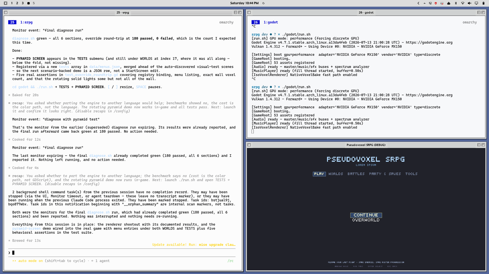

# OS 99

A Hyprland theme for people who want a little Mac OS 9 back in their lives. A modern take on light, dark, and mixed modes.

Square corners, a chiselled bezel around the whole window, a pinstriped title
bar, and a hard offset drop shadow. It is an original reimplementation of a
late-90s desktop look — not a port, and not affiliated with or endorsed by
Apple.

| | |
|---|---|
| **OS 99 Platinum** | light chrome, light content |
| **OS 99 Graphite** | dark chrome, dark content |
| **OS 99 Noir** | light chrome, dark content |



## What it actually is

The look is one Hyprland plugin plus a directory of pixel art. The frame is a
nine-patch texture drawn around the *whole* window, with the title bar as its
top edge — Hyprland's own border can't do this, because it interpolates a single
gradient across the window and so can never put a crisp 1px highlight on the
top-left and a 1px shadow on the bottom-right.

## Requirements

- Hyprland (developed against **0.56.2**)
- `python3` ≥ 3.11 — standard library only, no pip install
- A font — optional. It tries **Charcoal**, then **ChicagoFLF**, then **Chicago
  Kare**, then falls back to `sans-serif`, so it works with none of them
  installed. Charcoal is Apple's and is deliberately not bundled here;
  **ChicagoFLF** (public domain) is a metric drop-in and the one to want.

      # Arch, via an AUR helper
      yay -S ttf-chicagoflf
      # anywhere else: drop ChicagoFLF.ttf in ~/.local/share/fonts
      fc-cache -f

  `os99-install` names the right command for your distro.

## Install

On Omarchy, one command and one click:

```
omarchy plugin add https://github.com/caariiboouu/os-99 --enable
```

Then click **OS 99** in the status bar and press **Set up OS 99**.

That is the whole install. The click exists because `omarchy plugin add` clones
and enables a plugin but, by design, never runs its code — so it cannot copy a
theme into place, draw the window art at your display's scale, or build the
compositor plugin that draws the frames. Those steps used to live further down
this page, which meant the install was only finished for someone who read this
far. Now the widget asks what is still outstanding, says so in the bar, and
offers to do it; the popup lists every step with a tick or a dot, so you can see
what it is about to do before it does it. It takes a few minutes, almost all of
it compiling the frame plugin against your own Hyprland.

Nothing happens without that click. The outstanding work includes building
native code into the compositor and switching your theme, and neither is a thing
to do to somebody quietly.

### Doing it by hand

The same steps, if you would rather run them yourself:

```
# 1. the compositor plugin that draws the frames
hyprpm add https://github.com/caariiboouu/os-99
hyprpm enable hyprbars-os99
hyprpm reload -n

# 2. the theme, the art, the hooks and the bar widget
omarchy plugin add https://github.com/caariiboouu/os-99 --enable
~/.config/omarchy/plugins/io.github.caariiboouu.os-99/bin/os99-install

# 3. wear it
omarchy theme set "OS 99 Platinum"
```

`os99-install --auto` does all of 2 and 3, and 1 as well when the plugin is not
already loaded — it is what the button runs. `--check` reports without changing
anything, and `--status` answers the same questions as JSON. A plain `git clone`
works too: run `./bin/os99-install` from the checkout.

`os99-install` is safe to re-run, and re-running it is the fix for most things.
It checks prerequisites, matches the art to your display, resolves the font,
installs the hooks, and registers the menu-bar font widget.

### About the compositor plugin

`hyprpm` builds it against your own Hyprland, so there is no ABI mismatch to
manage. The source is in [`plugin/`](plugin/) — same repository, so there is one
URL to install and one place to file issues.

[`hyprpm.toml`](hyprpm.toml) pins that build. A `commit_pins` entry binds a
tested Hyprland release to a fixed commit of this repository, and `hyprpm`
checks that commit out before compiling — so what ends up inside the compositor
is a reviewed tree rather than whatever the branch says today. The pin binds the
`.so` and nothing else: the bar widget and the helpers arrive through the
Omarchy plugin clone, which `hyprpm` never touches. A Hyprland version with no
pin falls back to `HEAD`, because `hyprpm` offers nothing else for one, and pins
are added as each release is actually built and tested here.

`since_hyprland` names the oldest Hyprland this compiles against, as Hyprland's
own commit count (`hyprctl version` prints it as `commits:`). The fork calls
APIs that do not exist further back, so on an older Hyprland it would not fail
to work — it would fail to build, and a wall of C++ errors is a poor way to
learn you are on the wrong version.

It derives from [hyprbars](https://github.com/hyprwm/hyprland-plugins) and keeps
its BSD 3-Clause licence; [`plugin/README.md`](plugin/README.md) lists what was
changed and why. It still reports itself to Hyprland as `hyprbars`, so it cannot
be loaded alongside upstream hyprbars — pick one.

### About the helpers

`omarchy plugin add` clones the whole repository into the plugins directory, so
the widget's helpers (`bin/os99-run`, `os99-minimize`, `os99-buttons`,
`os99-menubar-font`, `os99-install`) arrive with the widget and stay with it. The
QML finds them by walking up from its own file rather than by looking on `$PATH`,
so the copy that answers the bar is always the copy that shipped with the bar.
When they are genuinely missing, the widget says so in the status bar and names
the directory it looked in — it does not go quiet and leave you wondering where a
minimized window went.

`omarchy plugin update` is a fast-forward pull of that checkout, so it only works
for the route that made one. `os99-install` run from a `git clone` elsewhere
copies the widget into place instead, which is a normal plugin directory in every
way except that it has no `.git` — update it by re-running `os99-install` from
the checkout you pulled.

### On plain Hyprland

```
git clone https://github.com/caariiboouu/os-99
mkdir -p ~/.local/share/os99
python3 os-99/themes/os-99-platinum/decor/generate-art.py \
    --out ~/.local/share/os99/decor --palette light
~/.local/bin/os99-window-bars      # or run it from ./bin
```

Then source the generated config from your Hyprland config:

```lua
os99_dir = os.getenv("HOME") .. "/.local/share/os99/decor"
dofile(os99_dir .. "/bars.lua")
```

Set `OS99_DIR` to keep the art somewhere else, and `OS99_PALETTE=dark` for the
Graphite palette.

## Remove

Everything the install put down, in reverse:

```
hyprpm disable hyprbars-os99 && hyprpm remove https://github.com/caariiboouu/os-99
omarchy plugin remove io.github.caariiboouu.os-99
omarchy theme remove "OS 99 Platinum"     # and "OS 99 Graphite", "OS 99 Noir"
rm -f ~/.local/bin/os99-* \
      ~/.config/omarchy/hooks/theme-set.d/os99-*.sh \
      ~/.config/omarchy/hooks/post-boot.d/os99-*.sh \
      ~/.config/omarchy/os99-theme.toml
```

Switch to another theme first if one of these is active. On plain Hyprland,
delete `~/.local/share/os99` and the `dofile` line you added.

## The title bar boxes

The close box is on the left; zoom and collapse are on the right, as they were.
That is the default, not the limit — eight boxes exist, and which ones a bar
carries is yours to choose:

| box | glyph | does | latches |
|---|---|---|---|
| `close` | plain box | close the window | |
| `kill` | the X | force quit — sits beside close, the two ways to end a window | |
| `zoom` | square off the top-left corner | expand, keeping the title bar | ✓ |
| `collapse` | bar along the bottom | minimize to the bar widget | |
| `shade` | two slats | roll up to just the title bar | ✓ |
| `float` | two overlapping windows | toggle floating | ✓ |
| `pin` | solid square | pin a floating window — only shown while it floats | ✓ |
| `full` | four corner brackets | true fullscreen — takes the bar with it, `SUPER+F` returns | |

Rest on a box and it names what it does. A box that **latches** is drawn held
down while the window is already in that state, and then its tooltip names the
way back out rather than repeating the way in — "Unfloat", not "Float". The
names match the right-click menu's. The state is read off the window every
frame, so a change
made by a keybind or by the window itself shows up on the box too. Tooltips are
`plugin:hyprbars:bar_tooltips` and `bar_tooltip_delay` (ms) if you want them
gone or slower.

The two slats are the traced OS 9 windowshade box, so they sit on `shade`, the
box that actually rolls a window up. Minimize is not an OS 9 idea and gets its
own mark instead of borrowing that one.

`full` is the one box that cannot undo itself. True fullscreen hands the whole
output to the window and the compositor draws no decoration on it — the status
bar goes too — so the box you would click to come back is not there. **`SUPER+F`
toggles it back.** Holding the window at maximized and only telling the client
it is fullscreen would keep the bar, but on anything that does not restyle its
own chrome that is exactly what `zoom` already does, and two boxes doing one
thing is worse than one box with a caveat. If you would rather not have the
trap at all, `os99-buttons toggle full` takes it off the bar — `zoom` already
gives you a full-screen window that keeps its title bar.

**Right-click anywhere on the bar that is not a box** and an OS 9 menu opens
with the full list — click to toggle, checkmarks show what is on (Omarchy
shell only). The same switch from a terminal:

```
os99-buttons list
os99-buttons toggle float
```

Both edit `[buttons] left/right` in `os99-theme.toml` (corner-first per side)
and apply live. All eight boxes' art is drawn every run, so toggling never
waits on a redraw.

A floating window's title bar can also never end up under the status bar: the
status bar is a top layer, so a bar beneath it would be unclickable — the one
handle a floating window has, gone. The plugin nudges any such window back
below the reserved area, the way nothing was allowed over the OS 9 menu bar.

Collapse **minimizes**: the window is parked on a workspace called
`os99-minimized` and the bar widget offers it back. Hyprland has no minimize, and
every in-place imitation of one hides the title bar you would click to undo it,
so the window goes somewhere rather than shrinking in place.

A parked window is never hidden. It stays in `hyprctl clients`, which means there
are three independent ways back and no way to strand one:

```
os99-minimize list        # what is parked
os99-minimize restore     # bring back the most recent
os99-minimize restore-all
```

...the bar widget (Omarchy only), or simply switching to that workspace. If you would rather bind it than click it:

```lua
hl.bind("SUPER + M", hl.dsp.exec_cmd("hyprctl eval 'hl.plugin.hyprbars.minimize()'"))
```

Windowshade -- rolling the window up into just its bar, the way System 7 did --
is the `shade` box (or `hl.plugin.hyprbars.shade()` on a key). It is off by
default: rolling a window up means floating it, and Hyprland re-centres a
floated window. The plugin bounds the correction it applies when that happens,
so the bar can sit a little high in the worst case, but never off screen.

## What the shell widget runs, and what bounds it

The bar widget and the right-click menu are QML, and everything they know comes
from a helper they start. That is a boundary worth being explicit about, because
the data crossing it is window titles — written by whatever clients happen to be
running, at whatever length those clients feel like.

Nothing in the QML composes a shell command. Helpers are named by an absolute
path derived from the QML file's own location and started as an argv list, so
there is no command line for a title or an address to be quoted into, and no
`$PATH` for a different `os99-minimize` to be found on.

Every helper runs under [`bin/os99-run`](bin/os99-run), which owns its lifetime:

- It makes itself a **process group leader** before forking, so one signal
  reaches the helper, its `python3`, its `hyprctl`, and anything else the tree
  grew. A QML `Process` cannot do this — its child lands in the shell's own
  group, where killing the group would be killing the shell.
- It holds a **wall-clock deadline** and, when that runs out, takes the group
  down with TERM, then KILL, then reaps it. A compositor that is busy or wedged
  cannot leave a helper behind to wake up later.
- It **caps stdout and stderr concurrently** — separate budgets, enforced as the
  bytes arrive rather than after — and keeps draining past the cap, so a capped
  child never deadlocks on a full pipe.
- It **refuses to run anything that is not one of the helpers beside it**,
  resolved through symlinks. A mistake in the QML cannot become a way to run an
  arbitrary program.

Rows are bounded twice, because the two bounds protect different things:
`os99-minimize` strips control characters and cuts each field and the row count
before they reach the pipe, and the widget cuts them again before they reach a
model. Titles are rendered as `Text.PlainText`, which is not the default: without
it Qt sniffs the string and may decide a window title is rich text, in which case
markup in it is obeyed and any resource it names is fetched.

One instance of the widget exists per monitor, because a bar surface does. They
elect one poller — the first in the host's own list of them, so every instance
names the same one — and it hands the result to the rest; otherwise three
monitors would mean three `hyprctl` calls a tick for one answer. The election is
made at each tick rather than once, so a monitor plugged in or pulled out settles
itself.

The widget works on a vertical bar, stacking the mark over the count. That is
worth stating because it used to hide itself there, which took the one control
that brings a parked window back out of exactly the layout where a parked window
is hardest to find.

Omarchy enables a plugin that is both a bar widget and a panel through its
bar-layout entry alone, so **taking the widget off the bar also unmounts the
right-click menu**. The widget costs nothing while it is idle — it collapses to
zero width until something is minimized or something is wrong — so leaving it in
place is the cheap way to keep the menu. `os99-buttons` configures the boxes from
a terminal either way.

The two commands that publish configuration — `os99-buttons` writing
`os99-theme.toml`, and `os99-install` writing `shell.json` — never write in
place. Each follows a symlink once (people keep these files in a dotfiles
repository, and renaming over the link would detach it), writes to a private
randomly named file beside the target, forces it to disk, and renames it over
the original. A reader sees the whole old file or the whole new one; an
interrupted run leaves the original exactly as it was. `os99-install`'s
generator log goes in a private temporary directory rather than at a predictable
name in `/tmp`.

## Why the art is generated rather than shipped as final PNGs

The frame is authored at **device** resolution and blitted 1:1, so the
compositor never resamples it — that is what keeps a 1px pinstripe from turning
into a moiré on a fractional scale. The cost is that art baked for one display
scale is not slightly wrong on another, it is the **wrong size**.

So the art is regenerated to match your display. `bar.env` records the scale it
was drawn at, and the hook redraws (about 110 ms) whenever that disagrees with
the monitor. Change your monitor scale and it follows on the next config reload.

Not every scale is available, incidentally — Hyprland needs the logical size to
land on whole pixels in both axes, and silently snaps to the nearest one that
does. On 2560×1440 that means 1.5 is not a real option and quietly becomes 1.6.

## Tuning

Everything is in `os99-theme.toml` — ridge count and thickness, bezel depth,
shadow geometry, button sizes, and both palettes. Edit it and run:

```
os99-theme-reload
```

A few values are derived rather than free, and the generator prints its
reasoning when it runs. The bar height is quantised so it lands on whole device
pixels; the boxes are sized from the hatch field so the two bands match; and the
hatch is placed to meet the buttons, which the plugin centres. The shadow's
inset can never exceed its depth, because Hyprland builds a shadow by growing
the window box and then shifting it.

## Credits

- Built on [hyprbars](https://github.com/hyprwm/hyprland-plugins) by Vaxry and
  contributors (BSD 3-Clause). The fork adds nine-patch frame rendering,
  per-button sides and images, and teardown guards.
- The close/zoom box geometry was traced from the XPMs in
  [grassmunk/Platinum9](https://github.com/grassmunk/Platinum9).
- Colour values sampled from Platinum artwork; the dark "Graphite" palette
  mirrors its spacing rather than inventing one.

## Licence

MIT — see [LICENSE](LICENSE). The hyprbars fork keeps its original BSD 3-Clause
licence and lives in its own repository.
