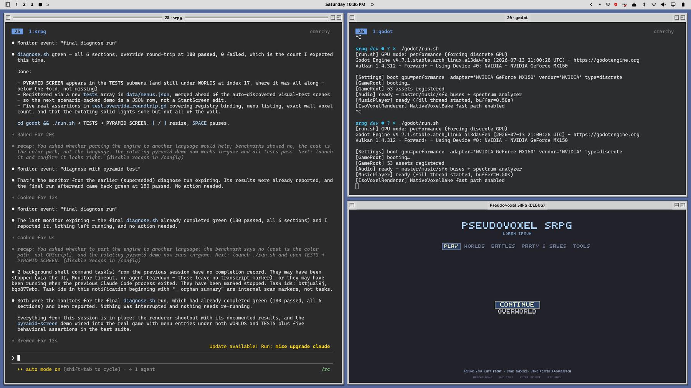

# OS 99

A Hyprland theme for people who want a little Mac OS 9 back in their lives.
Square corners, a chiselled bezel around the whole window, a pinstriped title
bar, and a hard offset drop shadow. It is an original reimplementation of a
late-90s desktop look — not a port, and not affiliated with or endorsed by
Apple.



## What you get

- **Three complete themes.** Not a colour scheme — window frames, status bar,
  menus, notifications, popups, launcher, lock screen, GTK and terminal colours,
  and four wallpapers each.

  | | | |
  |---|---|---|
  | [**Noir**](themes/os-99-noir/preview.png) | light chrome, dark content | **the default** — OS 9 windows, dark apps |
  | [**Platinum**](themes/os-99-platinum/preview.png) | light chrome, light content | the 1999 original, all the way down |
  | [**Graphite**](themes/os-99-graphite/preview.png) | dark chrome, dark content | for people who live in the dark |

  Noir is what the install lands on. The frames and the menu bar are the point
  of this theme, and Noir shows them without also turning every editor and
  terminal white. `omarchy theme set "OS 99 Platinum"` when you want the whole
  1999 experience.

- **A real nine-patch window frame**, drawn around the *whole* window with the
  title bar as its top edge. Hyprland's own border cannot do this: it
  interpolates one gradient across the window, so it can never put a crisp 1px
  highlight on the top-left and a 1px shadow on the bottom-right.
- **Eight title-bar boxes** — close, force quit, zoom, collapse, windowshade,
  float, pin, fullscreen — and you choose which ones a bar carries, from a
  right-click menu on the bar itself or from a terminal.
- **Minimize**, which Hyprland does not have. Windows park on their own
  workspace and come back from a bar widget, a command, or by switching to it.
- **Windowshade**, rolling a window up into just its title bar, the way System 7
  did.
- **Tooltips** on every box, with an OS 9 delay, that name the way *out* of a
  state when the window is already in it.
- **Art generated at your display's scale**, so a 1px pinstripe stays 1px on a
  fractional scale instead of turning into a moiré.

## Requirements

- **Hyprland**, 0.56.2 or newer. The frame plugin is compiled against your own
  Hyprland by `hyprpm`, so you need whatever it needs to build a plugin —
  on Arch, `base-devel` and `cmake`.
- **Omarchy** for the one-click install, the bar widget and the right-click
  menu. Everything else works on plain Hyprland; see
  [On plain Hyprland](#on-plain-hyprland).
- **python3 ≥ 3.11** — standard library only, no pip install.
- **A font**, optional. It tries **Charcoal**, then **ChicagoFLF**, then
  **Chicago Kare**, then falls back to `sans-serif`, so it works with none of
  them installed. Charcoal is Apple's and is deliberately not bundled here;
  **ChicagoFLF** (public domain) is a metric drop-in and the one to want.

      # Arch, via an AUR helper
      yay -S ttf-chicagoflf
      # anywhere else: drop ChicagoFLF.ttf in ~/.local/share/fonts
      fc-cache -f

  `os99-install` names the right command for your distro.

## Install

On Omarchy, one command and one click:

```
omarchy plugin add https://github.com/caariiboouu/os-99 --enable
```

Then click **OS 99** in the status bar and press **Set up OS 99**.

That is the whole install. The click exists because `omarchy plugin add` clones
and enables a plugin but, by design, never runs its code — so it cannot copy a
theme into place, draw the window art at your display's scale, or build the
compositor plugin that draws the frames. The widget asks what is still
outstanding, says so in the bar, and offers to do it; the popup lists every step
with a tick or a dot, so you can see what it is about to do before it does it.
It takes a few minutes, almost all of it compiling the frame plugin against your
own Hyprland, and it finishes on **OS 99 Noir**.

Nothing happens without that click. The outstanding work includes building
native code into the compositor and switching your theme, and neither is a thing
to do to somebody quietly.

The same widget is how you get back after a Hyprland upgrade, which breaks every
compiled plugin: the frames vanish, the widget notices the plugin is no longer
loaded, and the button rebuilds it.

### Doing it by hand

The same steps, if you would rather run them yourself:

```
# 1. the compositor plugin that draws the frames -- pick ONE
cd os-99/packaging && makepkg -si   # a package: ~90s, pinned to your Hyprland
./bin/os99-hyprbars-rebuild         # the same build, into ~/.local/lib

# 2. the theme, the art, the hooks and the bar widget
omarchy plugin add https://github.com/caariiboouu/os-99 --enable
~/.config/omarchy/plugins/io.github.caariiboouu.os-99/bin/os99-install

# 3. wear it
omarchy theme set "OS 99 Noir"
```

Either of those builds against the Hyprland headers your distribution already
ships — 595 of them under `/usr/include/hyprland/` on Arch, with a `pkg-config`
entry naming the version. The package additionally pins itself to a Hyprland
version range, so an upgrade that would break the plugin is announced by pacman
rather than silently taking your title bars away. See
[`packaging/`](packaging) for the PKGBUILD and the reasoning.

There is a third way, and `os99-install --auto` falls back to it when no headers
are packaged:

```
hyprpm update                 # clones and builds HYPRLAND for headers: minutes
hyprpm add https://github.com/caariiboouu/os-99
hyprpm enable hyprbars-os99 && hyprpm reload
```

`hyprpm update` is not optional there — `hyprpm add` refuses outright with
*Headers outdated, please run hyprpm update* when they are missing, which on a
machine that has never used hyprpm they always are. It took seven and a half
minutes here to produce headers `/usr/include/hyprland` already had, which is
why it is the fallback and not the route.

`os99-install --auto` does 2 and 3, and 1 as well when no hyprbars is loaded —
it is what the button runs. For 1 it tries, in order: a plugin already built on
this machine, then `make` against packaged headers, then hyprpm. A plain `git clone` works too: run
`./bin/os99-install` from the checkout.

`os99-install --selftest` is the gate against drift: every script still parses,
every QML file still parses (a QML syntax error raises nothing anyone sees — the
widget simply never appears), the manifest still agrees with itself and with the
commit its `hyprpm.toml` pin names, `os99-run` still holds a deadline and kills
the process group behind it, and a config round-trips byte for byte. It touches
nothing outside a temporary directory.

`os99-install` is safe to re-run, and re-running it is the fix for most things.
It checks prerequisites, matches the art to your display, resolves the font,
installs the hooks, and puts the bar widget in your bar.

### On plain Hyprland

The frame plugin, the title-bar boxes and windowshade all work without Omarchy.
The bar widget and the right-click menu do not — they are Quickshell, and they
need Omarchy's shell to live in. `os99-minimize` from a terminal does the same
job.

```
git clone https://github.com/caariiboouu/os-99
mkdir -p ~/.local/share/os99
python3 os-99/themes/os-99-platinum/decor/generate-art.py \
    --out ~/.local/share/os99/decor --palette light
./os-99/bin/os99-window-bars
```

Then source the generated config from your Hyprland config:

```lua
os99_dir = os.getenv("HOME") .. "/.local/share/os99/decor"
dofile(os99_dir .. "/bars.lua")
```

Set `OS99_DIR` to keep the art somewhere else, and `OS99_PALETTE=dark` for the
Graphite palette.

## The title bar boxes

The close box is on the left; zoom and collapse are on the right, as they were.
That is the default, not the limit — eight boxes exist, and which ones a bar
carries is yours to choose:

| box | glyph | does | latches |
|---|---|---|---|
| `close` | plain box | close the window | |
| `kill` | the X | force quit — sits beside close, the two ways to end a window | |
| `zoom` | square off the top-left corner | expand, keeping the title bar | ✓ |
| `collapse` | bar along the bottom | minimize to the bar widget | |
| `shade` | two slats | roll up to just the title bar | ✓ |
| `float` | two overlapping windows | toggle floating | ✓ |
| `pin` | solid square | pin a floating window — only shown while it floats | ✓ |
| `full` | four corner brackets | true fullscreen — takes the bar with it, `SUPER+F` returns | |

Rest on a box and it names what it does. A box that **latches** is drawn held
down while the window is already in that state, and then its tooltip names the
way back out rather than repeating the way in — "Unfloat", not "Float". The
names match the right-click menu's. The state is read off the window every
frame, so a change made by a keybind or by the window itself shows up on the box
too. Tooltips are `plugin:hyprbars:bar_tooltips` and `bar_tooltip_delay` (ms) if
you want them gone or slower.

The two slats are the traced OS 9 windowshade box, so they sit on `shade`, the
box that actually rolls a window up. Minimize is not an OS 9 idea and gets its
own mark instead of borrowing that one.

`full` is the one box that cannot undo itself. True fullscreen hands the whole
output to the window and the compositor draws no decoration on it — the status
bar goes too — so the box you would click to come back is not there. **`SUPER+F`
toggles it back.** Holding the window at maximized and only telling the client
it is fullscreen would keep the bar, but on anything that does not restyle its
own chrome that is exactly what `zoom` already does, and two boxes doing one
thing is worse than one box with a caveat. If you would rather not have the
trap at all, `os99-buttons toggle full` takes it off the bar — `zoom` already
gives you a full-screen window that keeps its title bar.

**Right-click anywhere on the bar that is not a box** and an OS 9 menu opens
with the full list — click to toggle, checkmarks show what is on (Omarchy shell
only). The same switch from a terminal:

```
os99-buttons list
os99-buttons toggle float
```

Both edit `[buttons] left/right` in `os99-theme.toml` (corner-first per side)
and apply live. All eight boxes' art is drawn every run, so toggling never waits
on a redraw.

A floating window's title bar can also never end up under the status bar: the
status bar is a top layer, so a bar beneath it would be unclickable — the one
handle a floating window has, gone. The plugin nudges any such window back below
the reserved area, the way nothing was allowed over the OS 9 menu bar.

## Minimize and windowshade

Collapse **minimizes**: the window is parked on a workspace called
`os99-minimized` and the bar widget offers it back. Hyprland has no minimize,
and every in-place imitation of one hides the title bar you would click to undo
it, so the window goes somewhere rather than shrinking in place.

A parked window is never hidden. It stays in `hyprctl clients`, which means
there are three independent ways back and no way to strand one:

```
os99-minimize list        # what is parked
os99-minimize restore     # bring back the most recent
os99-minimize restore-all
```

…the bar widget (Omarchy only), or simply switching to that workspace. If you
would rather bind it than click it:

```lua
hl.bind("SUPER + M", hl.dsp.exec_cmd("hyprctl eval 'hl.plugin.hyprbars.minimize()'"))
```

Windowshade — rolling the window up into just its bar, the way System 7 did — is
the `shade` box, or `hl.plugin.hyprbars.shade()` on a key. It is off by default:
rolling a window up means floating it, and Hyprland re-centres a floated window.
The plugin bounds the correction it applies when that happens, so the bar can
sit a little high in the worst case, but never off screen.

## Tuning

Everything is in `os99-theme.toml` — ridge count and thickness, bezel depth,
shadow geometry, button sizes, and both palettes. Edit it and run:

```
os99-theme-reload
```

A few values are derived rather than free, and the generator prints its
reasoning when it runs. The bar height is quantised so it lands on whole device
pixels; the boxes are sized from the hatch field so the two bands match; and the
hatch is placed to meet the buttons, which the plugin centres. The shadow's
inset can never exceed its depth, because Hyprland builds a shadow by growing
the window box and then shifting it.

### Why the art is generated rather than shipped as final PNGs

The frame is authored at **device** resolution and blitted 1:1, so the
compositor never resamples it — that is what keeps a 1px pinstripe from turning
into a moiré on a fractional scale. The cost is that art baked for one display
scale is not slightly wrong on another, it is the **wrong size**.

So the art is regenerated to match your display. `bar.env` records the scale it
was drawn at, and the hook redraws (about 110 ms) whenever that disagrees with
the monitor. Change your monitor scale and it follows on the next config reload.

Not every scale is available, incidentally — Hyprland needs the logical size to
land on whole pixels in both axes, and silently snaps to the nearest one that
does. On 2560×1440 that means 1.5 is not a real option and quietly becomes 1.6.

## Commands

Everything is a script in [`bin/`](bin), installed to `~/.local/bin` and shipped
beside the widget. Each one explains itself with `--help`.

| command | what it is for |
|---|---|
| `os99-install` | set up, check, or undo. `--auto` finishes everything, `--check` reports, `--status` answers as JSON, `--remove` uninstalls |
| `os99-buttons` | which boxes the title bar carries: `list`, `toggle <box>`, `apply` |
| `os99-minimize` | park a window and bring it back: `minimize`, `list`, `restore`, `restore-all` |
| `os99-theme-reload` | redraw the art after editing `os99-theme.toml`, without a config reload |
| `os99-window-bars` | load and configure the frame plugin while an OS 99 theme is active, and unload it otherwise. This is what the theme hook runs |
| `os99-hyprbars-rebuild` | rebuild the fork against the running Hyprland after an upgrade |
| `os99-run` | the bounded launcher the bar widget starts every helper through |
| `os99-widget-check` | ask the running shell whether OS 99's QML actually loaded, and say so if it did not |
| `os99-lib.sh` | sourced, not run: which Hyprland is listening, where state goes, how a config file is published |
| `os99-menubar-font` | print the font face the title bars resolved to |
| `os99-bar-menu` | open the right-click menu at the cursor; the plugin spawns this |

## Troubleshooting

**The window frames disappeared after a system update.** Hyprland plugins are
ABI-pinned, so a Hyprland upgrade does not make the plugin misbehave — it stops
it loading, and the frames (which are also the title bars) go with it.

You should not have to work that out. The load is verified rather than assumed:
when it fails you get a notification naming both versions — *built for Hyprland
v0.56.2, running v0.57.0* — the bar item changes to **Hyprland was updated**,
and its button becomes **Rebuild window frames**. Pressing it rebuilds; if a
usable build is already on disk it is simply loaded, which takes a second
instead of minutes. From a terminal, `os99-install --auto`,
`os99-hyprbars-rebuild`, or `hyprpm update`.

The notification is sent once per Hyprland version, not once per hook run — this
hook also fires on every theme switch, and a notification that repeats is one
people learn to dismiss. `~/.local/state/os99/plugin-failed` holds the
diagnosis, and is removed the moment a load succeeds.

**The frame is the wrong size, or the pinstripe shimmers.** The art is drawn at
your display's scale and does not survive a change of scale. Run `os99-install`
again; it redraws to match.

**The title bar text is not the OS 9 face.** No Chicago-alike font is installed.
`os99-install` says which one it resolved and names the package for your distro.

**The right-click menu does nothing.** It is the Omarchy shell's, and the plugin
is enabled through its bar-layout entry — so taking the widget off your bar also
unmounts the menu. `os99-buttons` does the same job from a terminal regardless.

**The widget vanished after an Omarchy update.** The bar widget and the menu run
inside Omarchy's own shell process, so a change to a type they extend or a
property they bind can stop the QML loading — and a widget that failed to load
cannot tell you it failed. A post-boot hook asks the shell instead, and notifies
once per session if OS 99's QML never answered. `os99-install --check` reports
the same thing on demand; `journalctl --user -e | grep caariiboouu` says why.
Parked windows are unaffected: they sit on a regular workspace and
`os99-minimize restore` still brings them back.

**A setup or removal was interrupted.** Every step is idempotent, so the fix is
to run it again — the record under `~/.local/state/os99/` exists to tell you
that something *was* interrupted and what your theme was before it started,
which is the one thing re-running cannot tell you.

**Corners look rounded, or the frame is clipped.** Nothing to edit: the plugin
holds rounding at 0 and blur off as a per-window rule on framed windows
(`plugin:hyprbars:frame_force_square` and `frame_force_flat`). If you have an
old `looknfeel.lua` branch on `os99.marker` from an earlier version, it is
redundant and can go.

**Both hyprbars are installed.** The fork still reports itself to Hyprland as
`hyprbars`, so it cannot be loaded alongside upstream hyprbars — pick one.

## Remove

```
os99-install --remove
```

It switches to another theme first, takes the widget off your bar, removes the
hooks, scripts and theme directories, and keeps your `os99-theme.toml` with a
timestamp — an evening spent tuning ridge counts should not be lost to an
uninstall.

It deliberately leaves the compositor plugin to you, because unloading one from
a running Hyprland restarts every window frame and is not a thing to do in the
middle of a script:

```
hyprpm disable hyprbars-os99
hyprpm remove https://github.com/caariiboouu/os-99
```

On plain Hyprland, delete `~/.local/share/os99` and the `dofile` line you added.

## Under the hood

The look is one Hyprland plugin plus a directory of pixel art. The plugin source
is in [`plugin/`](plugin) — same repository, so there is one URL to install and
one place to file issues — and `hyprpm` builds it against your own Hyprland, so
there is no ABI mismatch to manage.

It puts native code inside the compositor and a widget inside a long-lived shell
process. [`docs/security.md`](docs/security.md) sets out what each of those is
allowed to do: how the widget starts its helpers and what bounds them, how
window titles are handled, how configuration is written, and how the build is
pinned.

## Credits

- Built on [hyprbars](https://github.com/hyprwm/hyprland-plugins) by Vaxry and
  contributors (BSD 3-Clause). The fork adds nine-patch frame rendering,
  per-button sides and images, tooltips, latched state, and teardown guards;
  [`plugin/README.md`](plugin/README.md) lists what changed and why.
- The close/zoom box geometry was traced from the XPMs in
  [grassmunk/Platinum9](https://github.com/grassmunk/Platinum9).
- Colour values sampled from Platinum artwork; the dark "Graphite" palette
  mirrors its spacing rather than inventing one.

## Licence

MIT — see [LICENSE](LICENSE). The hyprbars fork keeps its original BSD 3-Clause
licence.
